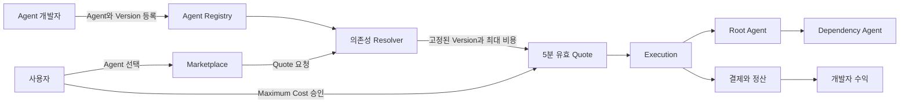
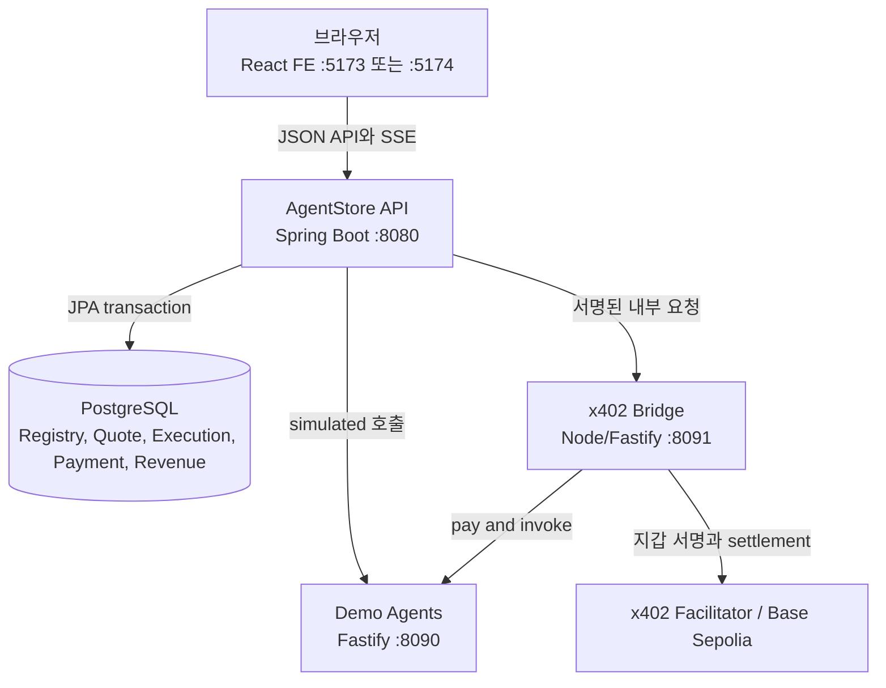
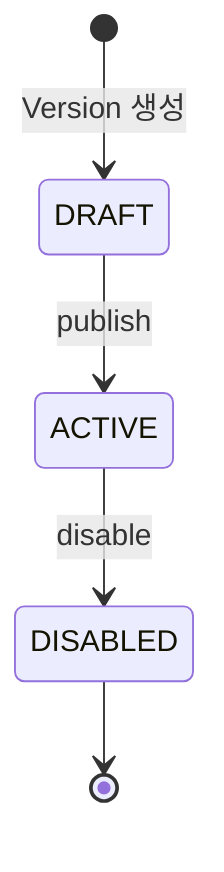
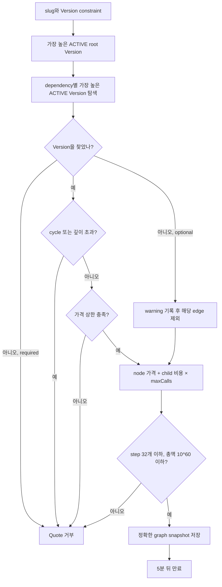
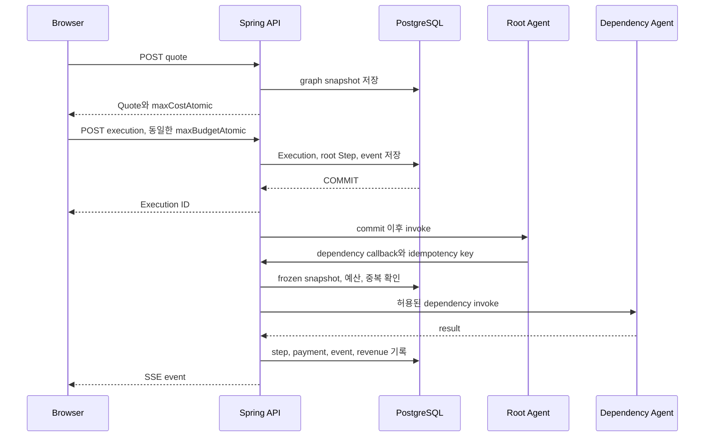
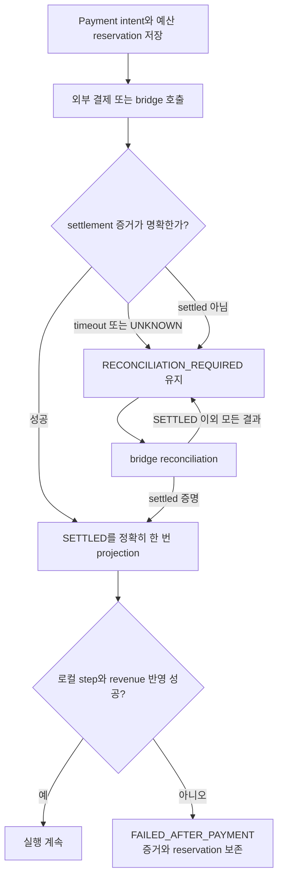

# AgentStore BE

AgentStore는 **AI Agent를 등록하고, Agent끼리 의존성을 연결하고, 실행 전에 최대 비용을 확정한 뒤, 실행·결제·수익을 추적하는 Marketplace**입니다. 이 저장소는 계약과 실행을 책임지는 Kotlin/Spring 백엔드이며 PostgreSQL, x402 결제 bridge, demo agent와 함께 동작합니다.

이 문서는 현재 구현만 설명합니다. 미래 계획이나 아직 연결되지 않은 기능은 포함하지 않습니다.

## 1. 가장 쉽게 이해하기

일반 앱스토어가 앱을 판매한다면 AgentStore는 호출 가능한 Agent를 판매합니다. 한 Agent가 일을 끝내기 위해 다른 Agent를 호출할 수 있다는 점이 핵심입니다.

1. 개발자가 Agent와 Version을 등록하고 `ACTIVE`로 publish합니다.
2. 사용자가 Marketplace에서 Agent를 고릅니다.
3. 서버가 모든 의존성 Version과 최대 비용을 확정한 Quote를 발급합니다.
4. 사용자가 Maximum Cost를 승인합니다.
5. 서버가 실행하면서 각 Agent 호출과 결제를 기록합니다.
6. 브라우저는 SSE로 과정을 실시간 표시합니다.
7. 성공한 결제는 개발자의 direct/dependency 수익으로 집계됩니다.



## 2. 전체 구조와 프로세스 경계



| 구성 요소 | 책임 | 가지면 안 되는 책임 |
|---|---|---|
| React FE | 목록, 입력, 승인, 실행 상태 표현 | DB 접근, private key, 결제 서명 |
| Spring API | 검증, Version 해석, Quote, 예산, 실행, 복구, 수익 | 사용자 지갑 private key |
| PostgreSQL | 영속 상태와 복구 근거 | 외부 Agent 호출 |
| Demo Agents | 로컬 실행 대상과 x402 응답 시뮬레이션 | Marketplace 원장 관리 |
| x402 Bridge | 비밀키, x402 SDK, pay-and-invoke, reconciliation | 공개 브라우저 API |

Spring API는 `8080`, demo agents는 `8090`, x402 bridge는 `8091`입니다. 이전 TypeScript API는 parity 참고 대상이었을 뿐 현재 runtime에 포함되지 않습니다.

## 3. 핵심 도메인

### Agent와 Version

- `Agent`는 이름, 설명, URL용 `slug`, 소유 개발자를 가집니다.
- 실제 endpoint, 가격, 결제 계약은 `AgentVersion`에 있습니다.
- Version 상태는 `DRAFT → ACTIVE → DISABLED`입니다.
- Marketplace와 Quote resolver는 `ACTIVE` Version만 사용합니다.
- `slug`는 소문자 영숫자와 하이픈 조합이며 최대 80자입니다.
- `priceAtomic`은 숫자로만 된 문자열입니다. 부동소수점 반올림을 피하려고 JSON number를 쓰지 않습니다.
- `responseFormat`은 Version이 반환할 결과 표현을 선언합니다. `TEXT`, `MARKDOWN`, `STRUCTURED`, `JSON` 중 하나이며, 생략된 기존 Version은 `JSON`으로 취급합니다.
- `TEXT`와 `MARKDOWN`은 문자열을, `STRUCTURED`는 `title`과 하나 이상의 `{label, value}` 섹션을 요구합니다. 섹션 값은 문자열·숫자·불리언만 허용합니다. `JSON`은 임의의 JSON을 허용합니다.



### Dependency

| 필드 | 의미 |
|---|---|
| `targetAgentId` | 호출할 대상 Agent |
| `versionConstraint` | exact, `^`, `~`, `*` Version 범위 |
| `required` | 해석 실패 시 Quote 전체를 실패시킬지 여부 |
| `maxPriceAtomic` | 선택할 dependency 가격 상한 |
| `maxCalls` | 이 edge의 최대 호출 수, 1~5 |

필수 dependency의 Version을 찾지 못하면 Quote가 실패합니다. 선택 dependency의 Version을 찾지 못한 경우에만 warning `OPTIONAL_DEPENDENCY_NOT_RESOLVED`를 남깁니다. Version은 찾았지만 `maxPriceAtomic`을 넘으면 required 여부와 관계없이 `DEPENDENCY_PRICE_EXCEEDED`로 Quote 전체를 거부합니다. 순환 참조는 전체 경로와 함께 거부되며, 호출 경로는 root를 포함해 최대 5개 Agent입니다.

### Quote는 견적이면서 실행 계약이다

Quote는 선택된 정확한 Version, endpoint, 가격, payment term, dependency graph를 snapshot으로 고정합니다. Quote 뒤에 새 Version이 publish되어도 이미 발급된 Quote의 의미는 바뀌지 않습니다.



최대 비용은 각 node 가격에 child 비용과 edge의 `maxCalls`를 곱해 누적합니다. 최대 32 step이며 계산값이 `10^60`을 넘으면 거부합니다.

### Execution과 Step

사용자는 Quote ID, 질문, `maxBudgetAtomic`을 제출합니다. 예산은 Quote의 `maxCostAtomic`과 **정확히 같아야** 합니다. Execution, root Step, 최초 event는 한 transaction에서 저장되고 실제 runner는 `afterCommit`에서만 시작합니다. commit되지 않은 실행이 외부 Agent를 호출하는 일을 막는 경계입니다.



Execution은 `PENDING → RUNNING → COMPLETED/FAILED`입니다. Step은 `CREATED`, `PAYMENT_REQUIRED`, `PAYMENT_SETTLED`, `RUNNING`, `COMPLETED`, `FAILED`를 사용하고 Payment는 `REQUIRED`, `AUTHORIZED`, `SETTLED`, `FAILED`, `RECONCILIATION_REQUIRED`를 사용합니다. 전체 실행, 개별 Step, Payment 상태가 같다고 가정하면 안 됩니다.

Agent output이 Version의 `responseFormat`과 맞지 않으면 결제 기록을 보존한 채 Step과 Execution을 `FAILED`로 전환하고 `AGENT_OUTPUT_FORMAT_INVALID`를 failure code로 기록합니다. 이 검증은 root Agent와 runtime dependency Agent 모두에 적용됩니다.

### Runtime dependency callback

내부 callback은 `POST /api/runtime/executions/{id}/dependencies/invoke`입니다.

- Bearer invocation token과 `Idempotency-Key`가 모두 필요합니다.
- token의 execution, parent step, Version, call path가 DB와 일치해야 합니다.
- Execution은 `RUNNING`, parent step은 활성 상태여야 합니다.
- dependency가 Quote의 frozen snapshot에 있어야 합니다.
- 요청 경로는 parent 바로 다음 node이며 최대 깊이를 넘을 수 없습니다.
- 완료된 동일 요청은 기존 결과를 반환하고 진행 중 중복은 새 호출을 만들지 않습니다.

즉 Agent가 견적에 없던 고가 Agent를 끼워 넣거나 재시도로 이중 호출하는 것을 막는 admission gate입니다.

## 4. 결제, 장애, 복구

- `PAYMENT_MODE=simulated`: 실제 chain 결제 없이 동일한 원장 흐름을 검사합니다.
- `PAYMENT_MODE=x402`: Spring이 인증된 내부 요청을 bridge에 보내고 bridge가 x402 SDK와 private key를 씁니다.

네트워크 timeout은 실패를 뜻하지 않습니다. 외부 결제는 성공하고 응답만 유실될 수 있어 서버는 side effect 전에 payment intent와 budget reservation을 먼저 영속화합니다.



UNKNOWN뿐 아니라 현재 reconciliation이 `SETTLED`을 증명하지 못한 모든 경우에 `RECONCILIATION_REQUIRED`와 reservation을 유지합니다. `DEFINITE_FAILURE` 응답도 자동으로 `FAILED` 전환하거나 reservation을 해제하는 근거로 쓰지 않습니다. settlement 뒤 로컬 projection이 실패해도 결제 사실을 지우지 않아 복구 근거를 보존합니다. private key, bridge secret, signed payload는 FE 환경 변수나 Git에 넣지 마세요.

## 5. SSE 실시간 이벤트

event는 DB에 먼저 저장한 후 publish합니다. `GET /api/executions/{id}/events`가 과거 replay와 live stream을 연결합니다.

- 증가 sequence와 SSE ID를 사용합니다.
- `Last-Event-ID` 이후부터 replay합니다.
- replay/live가 겹쳐도 ID와 sequence로 중복 적용하지 않습니다.
- terminal event 뒤 stream을 닫습니다.
- 브라우저 연결이 끊겨도 서버 실행은 계속됩니다.

## 6. Marketplace 목록의 작은 규칙

`GET /api/agents`는 `q`, `sort`, `cursor`, `limit`을 받습니다.

- `sort`: `NEWEST` 또는 `NAME_ASC`.
- ACTIVE Version이 하나 이상 있는 Agent만 반환합니다.
- 항목의 Version 목록도 ACTIVE만 포함합니다.
- `dependencyCount`는 서로 다른 target Agent 수입니다.
- cursor는 검색어와 정렬 조건에 묶인 opaque HMAC 값입니다.
- 다른 조건에 cursor를 재사용할 수 없고 클라이언트가 내용을 해석하면 안 됩니다.
- 반환된 row가 나중에 삭제/비활성화돼도 다음 페이지를 이어 갈 수 있습니다.

## 7. API와 공통 응답

일반 JSON은 `CommonResponse<T>` envelope를 사용합니다. 추적 ID는 JSON이 아니라 `X-Trace-Id` header에 있습니다.

```json
{"isSuccess": true, "message": "요청이 성공했습니다.", "result": {}}
```

| Method | Path | 역할 |
|---|---|---|
| GET | `/health` | 상태 확인 |
| GET / POST | `/api/agents` | 목록 / 등록 |
| GET | `/api/agents/{slug}` | 상세 |
| PATCH / DELETE | `/api/agents/{id}` | 수정 / 삭제 |
| POST | `/api/agents/{id}/versions` | Version 생성 |
| POST | `/api/agent-versions/{id}/publish` | 활성화 |
| POST | `/api/agent-versions/{id}/disable` | 비활성화 |
| GET / POST | `/api/agent-versions/{id}/dependencies` | dependency 조회 / 추가 |
| PATCH / DELETE | `/api/agent-versions/{id}/dependencies/{dependencyId}` | 수정 / 삭제 |
| POST | `/api/agents/{slug}/quotes` | Quote 발급 |
| POST / GET | `/api/executions`, `/api/executions/{id}` | 시작 / snapshot |
| GET | `/api/executions/{id}/events` | SSE |
| GET | `/api/developers/{id}/revenue` | 수익 |

runtime callback은 일반 사용자용 API가 아닙니다.

## 8. 로컬 실행

준비물은 Java 25, PostgreSQL, Node.js 24입니다.

```powershell
Copy-Item .env.example .env
.\gradlew.bat classes
.\gradlew.bat test
.\gradlew.bat bootRun
```

API는 `http://localhost:8080`, OpenAPI는 `http://localhost:8080/openapi.json`입니다. 기본 DB는 `localhost:5432/agent_store`입니다. Docker가 다른 host port를 쓰면 `.env`의 `DATABASE_URL`도 맞추십시오. 시작 시 Flyway migration을 적용하고 Hibernate가 schema를 validate합니다. 이미 적용한 migration을 수정하지 말고 새 migration을 추가합니다.

| 변수 | 기본/예시 | 설명 |
|---|---|---|
| `PORT` | `8080` | API port |
| `DATABASE_URL` | PostgreSQL URL | DB와 schema |
| `CORS_ORIGINS` | `http://localhost:*` | 쉼표 구분 origin pattern |
| `RUNTIME_TOKEN_SECRET` | 로컬 값 필요 | callback token과 cursor 서명 |
| `PAYMENT_MODE` | `simulated` | `simulated` 또는 `x402` |
| `X402_BRIDGE_URL` | `http://127.0.0.1:8091` | bridge 주소 |
| `X402_BRIDGE_SECRET` | 로컬 값 필요 | Spring↔bridge 인증 |
| `DEMO_PAYMENT_MODE` | `simulated` | demo agent 결제 동작 |

credentials를 허용하므로 CORS 전체 origin `*`는 사용할 수 없습니다. 로컬 기본 `http://localhost:*`는 Vite의 가변 port만 허용합니다. 운영에서는 정확한 HTTPS origin으로 제한합니다.

Node 하위 앱의 `dev` script는 실행 위치 기준 `../../.env`, 즉 **BE root가 아니라 `node/.env`**를 읽습니다. root 설정을 복사한 후 Node 전용 값을 그 파일에 추가합니다. 이 파일도 Git에 올리지 않습니다.

```powershell
# agent-store-be root
Copy-Item .env node\.env
```

Demo Agents는 별도 terminal에서 실행합니다. simulated mode는 `DEMO_PAYMENT_MODE=simulated`만으로 실행됩니다. x402 demo mode에는 `X402_FACILITATOR_URL`과 Investment/Financial/News/Risk 각각의 `DEMO_<NAME>_PRICE_ATOMIC`, `DEMO_<NAME>_PAY_TO`가 필요하며 asset을 지정한다면 `DEMO_<NAME>_ASSET`도 공식 Base Sepolia USDC 주소와 일치해야 합니다.

```powershell
Set-Location node\apps\demo-agents
npm install
npm run dev
```

x402 bridge는 `PAYMENT_MODE=x402`일 때 별도 terminal에서 실행합니다. `node/.env`에 Spring과 동일한 `X402_BRIDGE_SECRET` 및 `0x` 뒤 64자리 hex인 유효한 `X402_PRIVATE_KEY`가 반드시 있어야 하며 선택적으로 `X402_BRIDGE_PORT`를 지정할 수 있습니다.

```powershell
Set-Location node\apps\x402-bridge
npm install
npm run dev
```

실제 x402 smoke는 지갑, facilitator, network 자금이 준비돼야 합니다. funded Base Sepolia 성공을 보장하지 않습니다.

## 9. OpenAPI와 FE 계약

Spring controller/DTO가 계약의 원본입니다. 계약을 바꾼 뒤 서버를 실행하고 다른 terminal에서 아래처럼 정적 artifact를 갱신합니다. `bootRun`만으로 파일이 자동 저장되지는 않습니다.

```powershell
Invoke-WebRequest http://localhost:8080/openapi.json -OutFile openapi\openapi.json
```

그다음 FE에서 생성 코드를 다시 만듭니다. FE의 `src/generated`는 직접 수정하지 않습니다.

## 10. 검증

```powershell
.\gradlew.bat classes
.\gradlew.bat test
.\gradlew.bat bootJar
git diff --check
```

PostgreSQL integration test는 일반 개발 DB와 분리된 `agent_store_integration` DB를 사용합니다. 기본 test profile은 `INTEGRATION_DATABASE_URL`이 없으면 이 DB를 사용하고, 명시적으로 전용 DB를 지정할 때만 이 변수를 override합니다. DB가 없다면 PostgreSQL 관리자 계정으로 먼저 생성합니다.

```powershell
docker exec pgvector createdb -U postgres agent_store_integration
```

그 뒤 `RUN_POSTGRES_INTEGRATION_TESTS=true`와 `SPRING_EXCLUSIVE_MAINTENANCE=true`를 모두 명시해야 실제 integration test가 실행됩니다. 일반 server boot용 안전장치가 아니라 파괴적 fixture 정리를 허용하는 test opt-in이며, 테스트 지원 코드도 `agent_store`에 연결되면 실패합니다. Node 하위 앱은 각 폴더에서 `npm run typecheck`, `npm test`, `npm run build`로 확인합니다.

## 11. 문제 해결

- **CORS 403:** 요청 `Origin`이 `CORS_ORIGINS`와 맞는지 확인하고 Spring을 재시작합니다. query string은 origin에 포함되지 않습니다.
- **Flyway checksum 오류:** 적용된 migration을 임의 수정한 상태입니다. 원본을 복구하거나 새 migration을 추가합니다. 공유 DB에서 성급히 `repair`하면 drift를 숨길 수 있습니다.
- **relation/column JDBC 오류:** 연결 DB/schema, Flyway 적용 상태, Docker host port와 `.env`를 확인합니다.
- **Quote 뒤 실행 거부:** Quote가 5분을 넘겼거나 예산이 정확히 같지 않거나 recovery readiness가 준비되지 않았을 수 있습니다. 새 Quote로 다시 승인합니다.

## 12. 보안 경계

- 금액은 atomic decimal string입니다.
- endpoint와 dependency는 Quote 시 검증되고 snapshot으로 고정됩니다.
- callback은 서명 token과 idempotency key를 검사합니다.
- 외부 결제 전 durable intent/reservation을 만듭니다.
- private key와 bridge secret은 브라우저와 Git 바깥에 둡니다.
- `X-Trace-Id`는 추적용이지 인증 수단이 아닙니다.
