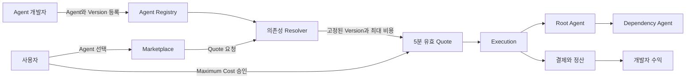
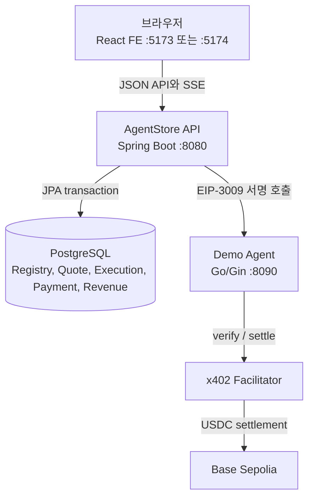
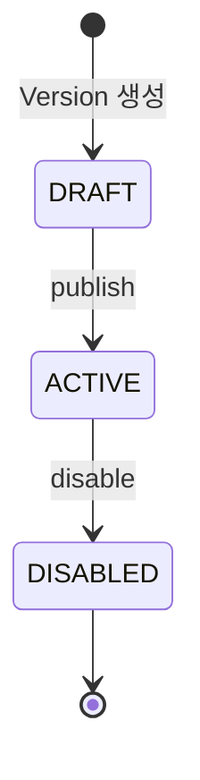
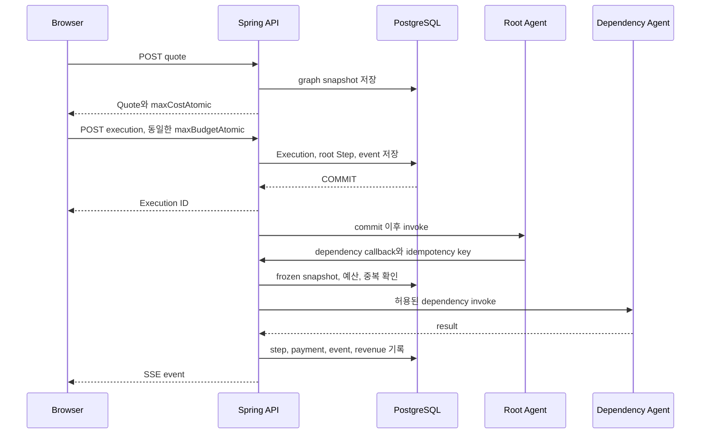
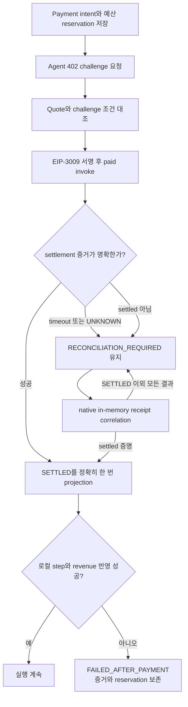

# AgentStore BE

AgentStore는 **AI Agent를 등록하고, Agent끼리 의존성을 연결하고, 실행 전에 최대 비용을 확정한 뒤, 실행·결제·수익을 추적하는 Marketplace**
입니다. 이 저장소는 계약과 실행, native x402 결제를 책임지는 Kotlin/Spring 백엔드이며 PostgreSQL과 선택적인 demo agent와 함께 동작합니다.

이 문서는 현재 구현만 설명합니다. 미래 계획이나 아직 연결되지 않은 기능은 포함하지 않습니다.

## 1. 가장 쉽게 이해하기

일반 앱스토어가 앱을 판매한다면 AgentStore는 호출 가능한 Agent를 판매합니다. 한 Agent가 일을 끝내기 위해 다른 Agent를 호출할 수 있다는 점이 핵심입니다.

1. 개발자가 Agent와 Version을 등록하고 `ACTIVE`로 publish합니다.
2. 사용자가 Marketplace에서 Agent를 고릅니다.
3. 서버가 모든 의존성 Version과 최대 비용을 확정한 Quote를 발급합니다.
4. 사용자가 Maximum Cost를 승인합니다.
5. 서버가 실행하면서 각 Agent 호출과 결제를 기록합니다.
6. 브라우저는 SSE로 과정을 실시간 표시합니다.
7. 성공한 결제는 개발자의 direct/dependency 수익으로 집계됩니다.



## 2. 전체 구조와 프로세스 경계



| 구성 요소       | 책임                                                               | 가지면 안 되는 책임               |
|-------------|------------------------------------------------------------------|---------------------------|
| React FE    | 목록, 입력, 승인, 실행 상태 표현                                             | DB 접근, private key, 결제 서명 |
| Spring API  | 검증, Version 해석, Quote, 예산, 실행, 복구, 수익, 전용 hot-wallet EIP-3009 서명 | 사용자 임의 지갑 관리              |
| PostgreSQL  | 영속 상태와 복구 근거                                                     | 외부 Agent 호출               |
| Go Demo Agent | 로컬 실행 대상과 x402 응답 시뮬레이션                                       | Marketplace 원장 관리         |

Spring API는 `8080`, 선택적인 Go demo-agent는 `8090`입니다. 운영 결제에 별도 런타임은 필요하지 않습니다.

## 3. 핵심 도메인

### Agent와 Version

- `Agent`는 이름, 설명, URL용 `code`, 소유 개발자를 가집니다.
- 실제 endpoint, 가격, 결제 계약은 `AgentVersion`에 있습니다.
- Version 상태는 `DRAFT → ACTIVE → DISABLED`입니다.
- Marketplace와 Quote resolver는 `ACTIVE + VERIFIED` Version만 사용합니다.
- `code`는 소문자 영숫자와 하이픈 조합이며 최대 80자입니다.
- `priceAtomic`은 숫자로만 된 문자열입니다. 부동소수점 반올림을 피하려고 JSON number를 쓰지 않습니다.
- `responseFormat`은 Version이 반환할 결과 표현을 선언합니다. `TEXT`, `MARKDOWN`, `STRUCTURED`, `JSON` 중 하나이며, 생략된
  기존 Version은 `JSON`으로 취급합니다.
- `TEXT`와 `MARKDOWN`은 문자열을, `STRUCTURED`는 `title`과 하나 이상의 `{label, value}` 섹션을 요구합니다. 섹션 값은
  문자열·숫자·불리언만 허용합니다. `JSON`은 임의의 JSON을 허용합니다.



### Dependency

| 필드                  | 의미                              |
|---------------------|---------------------------------|
| `targetAgentId`     | 호출할 대상 Agent                    |
| `versionConstraint` | Python식 비교 조건으로 지정하는 Version 범위 |
| `required`          | 해석 실패 시 Quote 전체를 실패시킬지 여부      |
| `maxPriceAtomic`    | 선택할 dependency 가격 상한            |
| `maxCalls`          | 이 edge의 최대 호출 수, 1~5            |

Version constraint는 `*`, 정확 버전의 `==1.0.0`, 또는 쉼표로 연결한 비교식
`>=1.0.0,<2.0.0`을 사용합니다. 비교식의 모든 조건을 만족해야 하며 `^`, `~`, 연산자 없는 Version은 허용하지 않습니다.

필수 dependency의 Version을 찾지 못하면 Quote가 실패합니다. 선택 dependency의 Version을 찾지 못한 경우에만 warning
`OPTIONAL_DEPENDENCY_NOT_RESOLVED`를 남깁니다. Version은 찾았지만 `maxPriceAtomic`을 넘으면 required 여부와 관계없이
`DEPENDENCY_PRICE_EXCEEDED`로 Quote 전체를 거부합니다. 순환 참조는 전체 경로와 함께 거부되며, 호출 경로는 root를 포함해 최대 5개
Agent입니다.

### Quote는 견적이면서 실행 계약이다

Quote는 선택된 정확한 Version, endpoint, 가격, payment term, dependency graph를 snapshot으로 고정합니다. Quote 뒤에 새
Version이 publish되어도 이미 발급된 Quote의 의미는 바뀌지 않습니다.


최대 비용은 각 node 가격에 child 비용과 edge의 `maxCalls`를 곱해 누적합니다. 최대 32 step이며 계산값이 `10^60`을 넘으면 거부합니다.

### Execution과 Step

사용자는 Quote ID, 질문, `maxBudgetAtomic`을 제출합니다. 예산은 Quote의 `maxCostAtomic`과 **정확히 같아야** 합니다. Execution,
root Step, 최초 event는 한 transaction에서 저장되고 실제 runner는 `afterCommit`에서만 시작합니다. commit되지 않은 실행이 외부
Agent를 호출하는 일을 막는 경계입니다.



Execution은 `PENDING → RUNNING → COMPLETED/FAILED`입니다. Step은 `CREATED`, `PAYMENT_REQUIRED`,
`PAYMENT_SETTLED`, `RUNNING`, `COMPLETED`, `FAILED`를 사용하고 Payment는 `REQUIRED`, `AUTHORIZED`,
`SETTLED`, `FAILED`, `RECONCILIATION_REQUIRED`를 사용합니다. 전체 실행, 개별 Step, Payment 상태가 같다고 가정하면 안 됩니다.

Agent output이 Version의 `responseFormat`과 맞지 않으면 결제 기록을 보존한 채 Step과 Execution을 `FAILED`로 전환하고
`AGENT_OUTPUT_FORMAT_INVALID`를 failure code로 기록합니다. 이 검증은 root Agent와 runtime dependency Agent 모두에
적용됩니다.

### Runtime dependency callback

내부 callback은 `POST /api/runtime/executions/{id}/dependencies/invoke`입니다.

- Bearer invocation token과 `Idempotency-Key`가 모두 필요합니다. Bearer token의 parsing·HMAC·만료 검증은
  `common.security`의 filter/helper가 수행하고, callback service에는 검증된 invocation principal만 전달합니다.
- Spring이 외부 Agent를 호출할 때도 같은 `Authorization: Bearer ...` header를 사용하며, Go demo-agent는 이를
  runtime callback에 그대로 전달합니다.
- token의 execution, parent step, Version, call path가 DB와 일치해야 합니다.
- Execution은 `RUNNING`, parent step은 활성 상태여야 합니다.
- dependency가 Quote의 frozen snapshot에 있어야 합니다.
- 요청 경로는 parent 바로 다음 node이며 최대 깊이를 넘을 수 없습니다.
- 완료된 동일 요청은 기존 결과를 반환하고 진행 중 중복은 새 호출을 만들지 않습니다.

즉 Agent가 견적에 없던 고가 Agent를 끼워 넣거나 재시도로 이중 호출하는 것을 막는 admission gate입니다.

## 4. 결제, 장애, 복구

- Spring은 전용 hot-wallet private key로 Base Sepolia USDC EIP-3009 payload를 직접 서명합니다.

네트워크 timeout은 실패를 뜻하지 않습니다. 외부 결제는 성공하고 응답만 유실될 수 있어 서버는 side effect 전에 payment intent와 budget
reservation을 먼저 영속화합니다.



서명 이후 receipt가 없거나 불명확하면 `RECONCILIATION_REQUIRED`와 reservation을 유지합니다. JVM 안의 동일 attempt/key
correlation이 성공 receipt를 증명할 때만 settlement를 복구하며, restart로 증거가 사라지면 재결제하지 않고 `UNKNOWN`을 유지합니다.
settlement 뒤 로컬 projection이 실패해도 결제 사실을 지우지 않아 복구 근거를 보존합니다. private key, typed data, signature와 raw
x402 header는 DB나 로그에 기록하지 않고 FE 환경 변수나 Git에 넣지 마세요.

## 5. SSE 실시간 이벤트

event는 DB에 먼저 저장한 후 publish합니다. `GET /api/executions/{id}/events`가 과거 replay와 live stream을 연결합니다.

- 증가 sequence와 SSE ID를 사용합니다.
- `Last-Event-ID` 이후부터 replay합니다.
- replay/live가 겹쳐도 ID와 sequence로 중복 적용하지 않습니다.
- terminal event 뒤 stream을 닫습니다.
- 브라우저 연결이 끊겨도 서버 실행은 계속됩니다.

## 6. Marketplace 목록의 작은 규칙

`GET /api/agents`는 `q`, `sort`, `cursor`, `limit`을 받습니다.

- `sort`: `newest` 또는 `name_asc`.
- ACTIVE Version이 하나 이상 있는 Agent만 반환합니다.
- 항목의 Version 목록도 ACTIVE만 포함합니다.
- `dependencyCount`는 서로 다른 target Agent 수입니다.
- cursor는 검색어와 정렬 조건에 묶인 opaque HMAC 값입니다.
- 다른 조건에 cursor를 재사용할 수 없고 클라이언트가 내용을 해석하면 안 됩니다.
- 반환된 row가 나중에 삭제/비활성화돼도 다음 페이지를 이어 갈 수 있습니다.

## 7. API와 공통 응답

일반 JSON은 `CommonResponse<T>` envelope를 사용합니다. 추적 ID는 JSON이 아니라 `X-Trace-Id` header에 있습니다.

```json
{
  "isSuccess": true,
  "message": "요청이 성공했습니다.",
  "result": {}
}
```

| Method         | Path                                                   | 역할                 |
|----------------|--------------------------------------------------------|--------------------|
| GET            | `/health`                                              | 상태 확인              |
| GET / POST     | `/api/agents`                                          | 목록 / 등록            |
| GET            | `/api/agents/{code}`                                   | 상세                 |
| PATCH / DELETE | `/api/agents/{id}`                                     | 수정 / 삭제            |
| POST           | `/api/agents/{id}/versions`                            | Version 생성         |
| POST           | `/api/demo/access`                                     | shared demo Bearer access 발급 |
| GET            | `/api/developer/me`, `/api/developer/agents`           | Bearer principal과 소유 Agent |
| GET            | `/api/developer/revenue`                                | Bearer principal 수익 |
| POST           | `/api/agent-versions/{id}/publish`                     | DRAFT paid certification 후 활성화 |
| POST           | `/api/agent-versions/{id}/verify`                      | ACTIVE UNVERIFIED/UNAVAILABLE 재검증 |
| POST           | `/api/agent-versions/{id}/verification-input/backfill` | legacy ACTIVE input 한 번 backfill |
| POST           | `/api/agent-versions/{id}/disable`                     | 비활성화               |
| GET / POST     | `/api/agent-versions/{id}/dependencies`                | dependency 조회 / 추가 |
| PATCH / DELETE | `/api/agent-versions/{id}/dependencies/{dependencyId}` | 수정 / 삭제            |
| POST           | `/api/agents/{code}/quotes`                            | Quote 발급           |
| POST / GET     | `/api/executions`, `/api/executions/{id}`              | 시작 / snapshot      |
| GET            | `/api/executions/{id}/events`                          | SSE                |
| GET            | `/api/developers/{id}/revenue`                         | 수익                 |

runtime callback은 일반 사용자용 API가 아닙니다.
개발자 기능은 `POST /api/demo/access`에서 발급한 365일
`Authorization: Bearer` access token이 필요합니다. token 없음·위조·만료는 `401`의
`CommonResponse`와 `X-Trace-Id`로 반환됩니다. 다른 소유자 변경은 `403`입니다. 이 데모
identity는 모든 방문자가 공유하며 실제 계정 인증이 아닙니다. Marketplace, `/v1`, runtime callback은 demo Bearer를
요구하거나 이를 해당 인증으로 오인하지 않습니다.

`POST /api/demo/access`는 별도 challenge나 환경변수 없이 공개적으로 365일 demo Bearer를
발급합니다. production에서도 동일한 bodyless 계약을 사용하며, 서명 비밀키가 교체되면 기존
토큰은 즉시 무효화됩니다.

Spring Security는 demo Bearer, callback invocation token과 external receipt token의 인증, stateless session, credential-less CORS 정책을
담당합니다. `TraceIdFilter`가 인증 필터보다 먼저 실행되어 실패 응답·로그·MDC가 같은 `X-Trace-Id`를 사용합니다.
execution/step/path/status/idempotency와 결제 권한은 각 도메인 service가 검증하며, 사용자 로그인·JWT/OAuth2는 아직 제공하지 않습니다.

## External x402 Invocation API

외부 개발자는 AgentStore 계정이나 영구 API key 없이도 Agent를 호출할 수 있습니다. 호출자는 한 번의 실행 intent를 만들고,
AgentStore가 제시한 Base Sepolia USDC x402 결제를 완료합니다. AgentStore는 받은 결제를 증명한 뒤에만 내부 Marketplace
Quote와 Execution을 만들고, 그 뒤 공급자 Agent 결제와 정산을 기존 실행 원장 안에서 처리합니다.

이 API는 AgentStore의 기본 공개 API이며, 서버가 기동되면 항상 노출됩니다. 아래 공개 설정은
`src/main/resources/application.yaml`에 명시하며, 모든 URL은 HTTPS 기본 port만 허용합니다. `pay-to`는
AgentStore가 받는 EVM 지갑입니다.

| YAML 키 | 설명 |
|---|---|
| `agent-store.external-api.public-base-url` | 외부 클라이언트가 실제로 접근하는 AgentStore HTTPS base URL |
| `agent-store.external-api.pay-to` | 외부 x402 USDC를 받는 AgentStore EVM 지갑 |
| `agent-store.external-api.facilitator-url` | `/verify`, `/settle`을 제공하는 HTTPS facilitator base URL |
| `agent-store.external-api.facilitator-request-timeout` | facilitator 요청 timeout (`PT5S` 형식) |
| `agent-store.external-api.authorization-timeout` | EIP-3009 authorization 유효 시간 (`PT60S` 형식) |
| `agent-store.external-api.fee-basis-points` | 공급자 Quote 비용에 더할 플랫폼 수수료 basis point |
| `agent-store.external-api.intent-ttl` | 결제 전 intent 유효 시간 |
| `agent-store.external-api.receipt-ttl` | 조회·SSE에 쓰는 1회 호출 receipt 유효 시간 |
| `agent-store.external-api.rate-limit-per-minute` | source IP 기준 intent 생성 한도 |

`POST /v1/invocations`에는 길이 16~128의 `Idempotency-Key`를 보냅니다. 같은 key와 같은 본문은 같은 invocation을
이어가고, 본문이 다르면 `409`입니다. `agentCode` + `versionConstraint`로 특정 Agent를 고르거나, `functionCode` +
`contractVersion` + `selectionStrategy`로 Function Contract 공급자를 고릅니다. 둘을 함께 보낼 수 없습니다.

```json
{
  "agentCode": "weather-summary",
  "versionConstraint": "*",
  "maxTotalAtomic": "1250000",
  "question": "서울 내일 날씨를 알려줘",
  "input": { "city": "Seoul" }
}
```

```json
{
  "functionCode": "weather.forecast-summary",
  "contractVersion": "1.0.0",
  "selectionStrategy": "lowest_price",
  "maxTotalAtomic": "1250000",
  "input": { "city": "Seoul" }
}
```

첫 요청은 `402`와 `PAYMENT-REQUIRED` header를 반환합니다. 조회에 필요한
`X-AgentStore-Invocation-Receipt` header도 함께 받습니다. 이 값은 bearer secret이므로 로그·브라우저 저장소·공개 URL에
넣지 마세요. 서버는 원문이 아니라 hash만 저장합니다. 외부 x402 client는 requirement의 v2 `exact` 조건과 완전히 일치하는
Base Sepolia USDC EIP-3009 `PAYMENT-SIGNATURE`를 만들어 **같은 본문과 Idempotency-Key로** `POST /v1/invocations`를
다시 호출합니다. 서명 검증과 facilitator settlement가 성공하면 `202`, `PAYMENT-RESPONSE`, 그리고 내부 `executionId`를 반환합니다. timeout·연결 손실·누락 receipt는 성공으로
추정하지 않고 `reconciliation_required`가 되며 새 결제나 다른 공급자 fallback을 시작하지 않습니다.

```powershell
$headers = @{
  'Idempotency-Key' = 'external-weather-request-0001'
  'Content-Type' = 'application/json'
}

Invoke-RestMethod `
  -Method Post `
  -Uri 'https://api.example.com/v1/invocations' `
  -Headers $headers `
  -Body '{"agentCode":"weather-summary","versionConstraint":"*","maxTotalAtomic":"1250000","input":{"city":"Seoul"}}'
```

상태는 `GET /v1/invocations/{invocationId}`, 실시간 진행은 `GET /v1/invocations/{invocationId}/events`에서 같은
receipt header로 조회합니다. receipt 인증은 Spring Security filter/helper가 수행하며, 유효하지 않은 receipt는 invocation
존재 여부를 노출하지 않는 응답으로 거절합니다. SSE는 기존 `Last-Event-ID` replay 규칙을 그대로 따릅니다. 최종 결과는 항상
`CommonResponse.result.output`에 들어가므로 외부 서비스는 실행 그래프가 아닌 Agent output만 간단히 소비할 수 있습니다.

## 8. 로컬 실행

개발 환경의 PostgreSQL, Spring API와 선택적인 Go demo-agent는 상위 폴더의
[`agent-store-infra`](../agent-store-infra)에서 함께 실행합니다. 프론트엔드는
`agent-store-fe`에서 로컬 Vite 서버로 실행합니다.

```powershell
Set-Location ../agent-store-infra
Copy-Item ../agent-store-be/.env.example ../agent-store-be/.env
Copy-Item ../demo-agent/.env.example ../demo-agent/.env
docker compose --env-file ../agent-store-be/.env up --build -d
```

Compose는 `postgres:17` PostgreSQL을 시작하고, 최초 volume 생성 시 `agent_store` DB를 준비합니다. API는 Compose가 주입하는 표준 datasource 환경변수로 PostgreSQL에
연결하며, 개발 profile을 활성화해 기존 loopback demo Agent endpoint를 유지합니다. API는
`http://localhost:8080`, OpenAPI는 `http://localhost:8080/openapi.json`, demo-agent는
`http://localhost:8090`에서 확인할 수 있습니다. Spring 시작 시 Flyway migration을 적용하고 Hibernate가 schema를
validate합니다. 이미 적용한 migration을 수정하지 말고 새 migration을 추가합니다.

| `.env` 값 | 용도 |
|---|---|
| `POSTGRES_PASSWORD` | Docker Compose PostgreSQL과 API의 개발용 PostgreSQL 비밀번호 |
| `RUNTIME_TOKEN_SECRET` | callback token과 cursor 서명 secret |
| `X402_PRIVATE_KEY` | 필수 저잔액 payer key, `0x` + 64자리 hex |
| `POSTGRES_PORT` | `agent-store-infra` Docker Compose가 직접 읽는 PostgreSQL host port |

Bearer 인증은 credential-less CORS로 동작하므로 CORS 전체 origin `*`는 사용할 수 없습니다. 로컬 기본 `http://localhost:*`는 Vite의 가변 port만 허용합니다.
운영에서는 `application.yaml` 또는 운영용 YAML의 `agent-store.cors-origins`를 정확한 HTTPS origin으로 제한합니다.

Demo Agent는 독립 Go 서비스다. Compose에서는 일반 service network를 사용하므로 API는 `api:8080`, demo-agent는
`demo-agent:8090`으로 통신한다. host에서는 demo-agent가 `127.0.0.1:8090`으로만 노출된다. Go의
`catalog/agents.yaml`이 demo 계약의 단일 원본이며, API와 Go health가 준비된 뒤 `catalog-bootstrap` one-shot service가
Function Contract 등록 → manifest import → Version publish 순서로 처리한다. 이미 ACTIVE 데이터가 있으면 catalog와
다른 내용을 덮어쓰지 않고 drift 오류로 중단한다. Spring은 더 이상 demo catalog를 직접 seed하지 않으며, `dev` 프로필의
`DevIdentityInitializer`는 개발자 registry가 비어 있을 때 bootstrap에 필요한 고정 demo identity만 만든다.

Spring은 `X402_PRIVATE_KEY`가 없거나 형식이 잘못되면 시작에 실패합니다. Base Sepolia 기본 USDC의 x402
v2 `exact`/EIP-3009만 지원하며 Permit2 challenge는 서명 전에 거절합니다. 실제 x402 smoke는 전용 지갑, facilitator, testnet
자금이 준비돼야 하며 funded Base Sepolia 성공을 보장하지 않습니다.


## 9. OpenAPI와 FE 계약

Spring controller/DTO가 계약의 원본입니다. 계약을 바꾼 뒤 서버를 실행하고 다른 terminal에서 아래처럼 정적 artifact를 갱신합니다. `bootRun`
만으로 파일이 자동 저장되지는 않습니다.

```powershell
Invoke-WebRequest http://localhost:8080/openapi.json -OutFile openapi\openapi.json
```

그다음 FE에서 생성 코드를 다시 만듭니다. FE의 `src/generated`는 직접 수정하지 않습니다.

## 10. 검증

```powershell
Set-Location ../agent-store-infra
docker compose --profile tools --env-file ../agent-store-be/.env run --rm gradle classes
docker compose --profile tools --env-file ../agent-store-be/.env run --rm gradle test
docker compose --profile tools --env-file ../agent-store-be/.env run --rm gradle bootJar
git diff --check
```

기본 Compose tools 검증은 unit test만 실행합니다. 실제 PostgreSQL과 랜덤 포트 Spring HTTP 서버를 쓰는 E2E는 전용 DB에서
별도로 실행합니다. `integrationTest`는 `RUN_POSTGRES_INTEGRATION_TESTS=true`,
`SPRING_EXCLUSIVE_MAINTENANCE=true`, `INTEGRATION_DATASOURCE_URL`,
`INTEGRATION_DATASOURCE_PASSWORD`를 요구하며 CI와 배포 전 gate에서 실행합니다.

```powershell
$env:RUN_POSTGRES_INTEGRATION_TESTS = 'true'
$env:SPRING_EXCLUSIVE_MAINTENANCE = 'true'
$env:INTEGRATION_DATASOURCE_URL = 'jdbc:postgresql://localhost:5432/agent_store_integration?currentSchema=public'
$env:INTEGRATION_DATASOURCE_PASSWORD = 'postgres'
.\gradlew.bat integrationTest
```

독립 Go demo-agent는 해당 프로젝트에서 `go test ./...`, `go vet ./...`, `go build ./...`로 확인합니다.

## Function Contract Marketplace

개발자는 `/api/function-contracts`에서 공용 입출력 계약을 만든 뒤 Agent Version에 `functionContractId`를 연결할 수 있습니다. 계약은 생성 후
수정하거나 삭제하지 않으며 변경이 필요하면 새 `contractVersion`을 등록합니다. dependency는 특정 Agent를 직접 지정하거나, function contract와
공급자 범위(`pinned`, `allowlist`, `marketplace`)·선택 전략을 선언합니다.

- `lowest_price`: 가격이 낮은 공급자부터 선택하고 같은 가격이면 최신 Version을 우선합니다.
- `latest_version`: 최신 Version부터 선택하고 같은 Version이면 가격이 낮은 공급자를 우선합니다.
- `highest_reliability`, `fastest`: 30일 실행 관측값을 쓰며, 관측이 부족하면 선택하지 않고 명시적으로 거절합니다.

공급자 선택은 Quote 발급 중에만 일어납니다. 선택된 Agent, Version, endpoint, 가격, `payTo`, 계약 Schema와 후보 제외 사유는 snapshot에
고정됩니다. 실행 중 호출 실패, 출력 계약 위반 또는 결제 불명 상태에서 다른 공급자로 자동 전환하거나 다시 결제하지 않습니다.

독립 공급자 reference scenario는 `agent-store-infra` Compose의 단일 demo-agent 서비스로 실행합니다. 같은 Go image가 투자,
쇼핑, 여행의 13개 code endpoint를 제공하며 x402 mode에서는 각 Agent가 고유 price와 `payTo`를 사용합니다. `dev` profile은 빈 DB에
Root 세 개와 전문 Agent catalog를 직접 등록합니다.

화면을 이용한 수동 시연에서는 Go Compose를 먼저 띄우고 개발자 모드의 `기능 계약`, Agent Version, Dependency 화면에서 같은 계약과
endpoint를 등록합니다. 시연용 실제 x402 지갑을 사용할 때는 Go 프로젝트 `.env`의 공급자별 `payTo`와 Spring에 등록한 Version의
`payTo`가 정확히 일치해야 합니다.

## 11. 문제 해결

- **CORS 403:** 요청 `Origin`이 `application.yaml`의 `agent-store.cors-origins`와 맞는지 확인하고 Spring을 재시작합니다. query string은 origin에 포함되지
  않습니다.
- **Flyway checksum 오류:** 적용된 migration을 임의 수정한 상태입니다. 원본을 복구하거나 새 migration을 추가합니다. 공유 DB에서 성급히
  `repair`하면 drift를 숨길 수 있습니다.
- **relation/column JDBC 오류:** `application.yaml`의 연결 DB/schema, Flyway 적용 상태, Docker host port와 datasource password를 확인합니다.
- **Quote 뒤 실행 거부:** Quote가 5분을 넘겼거나 예산이 정확히 같지 않거나 recovery readiness가 준비되지 않았을 수 있습니다. 새 Quote로 다시
  승인합니다.

## 12. 보안 경계

- 금액은 atomic decimal string입니다.
- endpoint와 dependency는 Quote 시 검증되고 snapshot으로 고정됩니다.
- callback은 서명 token과 idempotency key를 검사합니다.
- 외부 결제 전 durable intent/reservation을 만듭니다.
- `X402_PRIVATE_KEY`는 Spring 배포 secret으로만 주입하고 브라우저, DB, 로그와 Git 바깥에 둡니다.
- `X-Trace-Id`는 추적용이지 인증 수단이 아닙니다.
